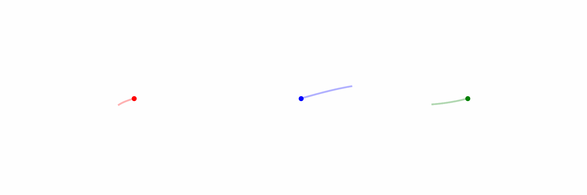

<h1 align="center">Hi there, I'm Martin</h1>
<h3 align="center">Writing code so entangled it defies locality</h3>

      
⚙️ Working on **Superconducting Circuits, Tensor Networks**

📚 Learning **Quantum Info, Condensed Matter & Field Theory...**

📧 Reach me at **martin.zapata-ferguson@tum.de**

❗️ Fun fact: **Pianist & Judoka**

<h3 align="left">Connect with me:</h3>

 

 

<h3 align="left">Languages and Tools:</h3>

 
 
 

<!-- 
-->

